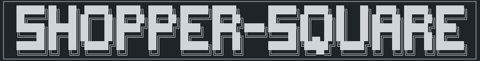

# Boutique en Ligne de Matériel Informatique Gaming

Bienvenue dans le projet de boutique en ligne spécialisée dans le matériel informatique gaming ! Ce projet est réalisé par une équipe de 8 personnes dans le cadre de notre projet de fin de formation. Notre objectif est de créer une plateforme qui propose des produits et des équipements de haute qualité pour les passionnés de gaming.

## Technologies Utilisées

- Framework Back-End : Symfony
- Framework Front-End : Vue.js
- Base de Données : MySQL
- Interface Utilisateur : Bootstrap

## Fonctionnalités
    //TODO

## Méthodologie de Travail

Nous utilisons la méthodologie Scrum pour organiser notre travail en équipe.

### Outils de Gestion de Projet

- **GitHub** :
  - Utilisé pour héberger notre code source et gérer les versions.
  - Facilite les pull requests, les révisions de code et le suivi des problèmes.
  - Utilisé pour héberger la documentation des fonctionalités téchniques.

- **Jira** :
  - Utilisé pour la planification et la gestion agile de notre projet.
  - Permet de définir des sprints, de suivre les tâches et d'assurer une vision globale de notre progression.

- **Notion** :
  - Notre espace d'équipe collaboratif pour la création, la documentation et l'organisation de ressources importantes.
  - Nous utilisons Notion pour définir nos spécifications, élaborer le backlog des user stories et partager des mood boards.

## Installation et Configuration

Suivez les instructions détaillées dans notre [Guide d'Installation](docs/installation.md) pour installer et configurer le projet.

Vous pourrez ensuite accéder à l'application via http://localhost:8000.

## Contributeurs
    //TODO

## Licence

Ce projet est sous licence [MIT](https://opensource.org/licenses/MIT).